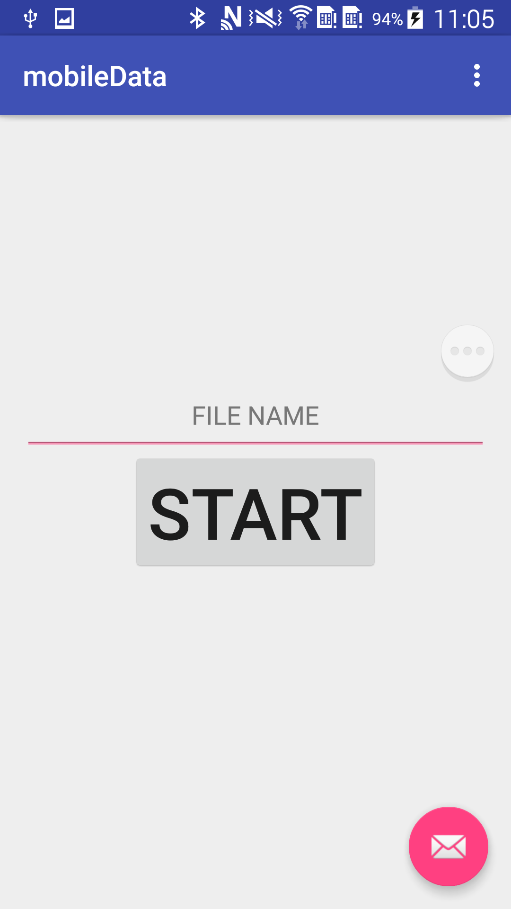
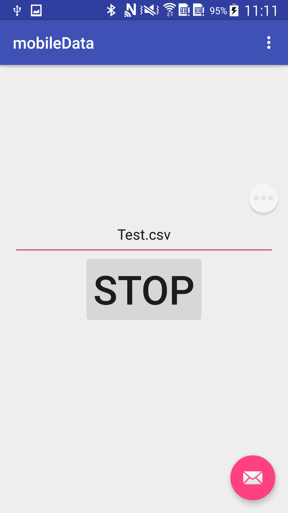
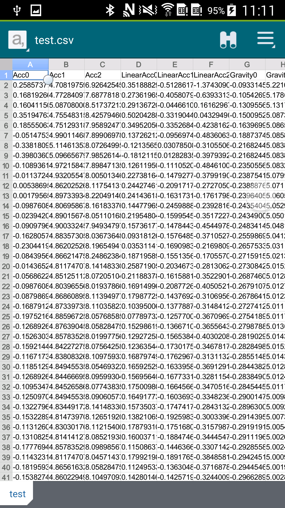

Single Device Sensor DataGetter
===

# 项目简介
1. Android 传感器数据采集并写csv文件 (安装mobiledata)
2. Android Wear 传感器数据采集并写csv文件




# 传感器数据
* 原始加速度
* 线性加速度
* 重力加速度
* 陀螺仪
* 磁力计
* 全局数据
* 合加速度
* 时间戳
* 时间间隔


# 相关项目
* [Multi-Sensor-DataCollector](https://github.com/LeoCai/Multi-Sensor-DataCollector)

依赖上述项目中的publiclibs项目

# 配置修改
* mobile data:
```java
sensorDataManager = new MySensorManager(this);
//修改频率（单位Hz）
sensorDataManager.setFrequency(50);
sensorDataManager.startSensor();
```
# 项目module介绍
* mobiledata 手机传感器采集
* wear 手表传感器采集
* magnetic 磁力方向据采集
* deletefile 手表数据删除
